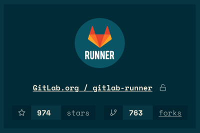

# Mozaïk GitLab widgets

[![License][license-image]][license-url]
[![Travis CI][travis-image]][travis-url]
[![NPM version][npm-image]][npm-url]
[![Coverage Status][coverage-image]][coverage-url]
![widget count][widget-count-image]

[![Deploy][heroku-image]][heroku-url]

> This branch contains code for the version compatible with
> Mozaïk v2, if you're looking for v1, please use
> [mozaik-1 branch](https://github.com/plouc/mozaik-ext-gitlab/tree/mozaik-1).

This repository contains some widgets to use with [Mozaïk](https://github.com/plouc/mozaik).

You can see a live demo of this extension [here](http://mozaik-gitlab.herokuapp.com/)

- [client configuration](#client-configuration)
- widgets
    - [Project](#project)
    - [Project Members](#project-members)
    - [Project Contributors](#gitlab-project-contributors)
    - [Branches](#gitlab-branches)
    - Jobs
        - [Job Histogram](#gitlab-job-histogram)
        - [Job History](#gitlab-job-history)
    - Labels
        - [Labels Bubble chart](#gitlab-labels-bubble-chart)
        - [Labels Pie](#gitlab-labels-pie)
        - [Labels Tree map](#gitlab-labels-tree-map)

## Client Configuration

In order to use the Mozaïk gitlab extension, you must configure its **client**.
Configuration is loaded from environment variables.

| env key          | required | default | description
|------------------|----------|---------|----------------------------
| GITLAB_BASE_URL  | yes      |         | gitlab API base url, eg. `'https://gitlab.com/api/v4`
| GITLAB_API_TOKEN | yes      |         | gitlab API token

## Project

> Show GitLab project info.



### parameters

key       | required | description
----------|----------|--------------------------
`project` | yes      | *ID or NAMESPACE/PROJECT_NAME of a project*

### usage

``` yaml
- extension: gitlab
  widget:    Project
  project:   gitlab-org/gitlab-ce
  columns:   1
  rows:      1
  x:         0
  y:         0
```

## Project Members

> Show GitLab project members.


### parameters

key       | required | description
----------|----------|--------------------------
`project` | yes      | *ID or NAMESPACE/PROJECT_NAME of a project*

### usage

``` yaml
- extension: gitlab
  widget:    ProjectMembers
  project:   gitlab-org/gitlab-ce
  columns:   1
  rows:      1
  x:         0
  y:         0
```


### GitLab Branches

> Show GitLab project branches.


#### parameters

key       | required | description
----------|----------|--------------------------
`project` | yes      | *ID or NAMESPACE/PROJECT_NAME of a project*

#### usage

``` yaml
# config.yml
dashboards:
- # …
  widgets:
  - extension: gitlab
    widget:    Branches
    project:   gitlab-org/gitlab-ce
    columns:   1
    rows:      1
    x:         0
    y:         0
```


### GitLab Job Histogram

> Show GitLab project job histogram.


#### parameters

key       | required | description
----------|----------|--------------------------
`project` | yes      | *ID or NAMESPACE/PROJECT_NAME of a project*

#### usage

``` yaml
# config.yml
dashboards:
- # …
  widgets:
  - extension: gitlab
    widget:    JobHistogram
    project:   gitlab-org/gitlab-ce
    columns:   2
    rows:      1
    x:         0
    y:         0
```


### GitLab Job History

> Show GitLab project job history.


#### parameters

key       | required | description
----------|----------|--------------------------
`project` | yes      | *ID or NAMESPACE/PROJECT_NAME of a project*

#### usage

``` yaml
# config.yml
dashboards:
- # …
  widgets:
  - extension: gitlab
    widget:    JobHistory
    project:   gitlab-org/gitlab-ce
    columns:   1
    rows:      1
    x:         0
    y:         0
```

### GitLab Project Contributors

> Show GitLab project contributors.


#### parameters

key       | required | description
----------|----------|--------------------------
`project` | yes      | *ID or NAMESPACE/PROJECT_NAME of a project*

#### usage

``` yaml
# config.yml
dashboards:
- # …
  widgets:
  - extension: gitlab
    widget:    ProjectContributors
    project:   gitlab-org/gitlab-ce
    columns:   1
    rows:      1
    x:         0
    y:         0
```

### GitLab labels bubble chart

> Show GitLab project's labels stats using a bubble chart.


#### parameters

key       | required | default               | description
----------|----------|-----------------------|----------------
`project` | yes      | *n/a*                 | *ID or NAMESPACE/PROJECT_NAME of a project*
`countBy` | yes      | `'open_issues_count'` | *Defines which count to use, must be one of: `'open_issues_count'`, `'closed_issues_count'`, `'open_merge_requests_count'`*
`title`   | no       | *n/a*                 | *Overrides widget title*

#### usage

``` yaml
# config.yml
dashboards:
- # …
  widgets:
  - extension: gitlab
    widget:    LabelsBubble
    project:   gitlab-org/gitlab-ce
    columns:   1
    rows:      1
    x:         0
    y:         0
```


### GitLab labels pie

> Show GitLab project's labels stats using a pie chart.


#### parameters

key       | required | default               | description
----------|----------|-----------------------|----------------
`project` | yes      | *n/a*                 | *ID or NAMESPACE/PROJECT_NAME of a project*
`countBy` | yes      | `'open_issues_count'` | *Defines which count to use, must be one of: `'open_issues_count'`, `'closed_issues_count'`, `'open_merge_requests_count'`*
`title`   | no       | *n/a*                 | *Overrides widget title*

#### usage

``` yaml
# config.yml
dashboards:
- # …
  widgets:
  - extension: gitlab
    widget:    LabelsPie
    project:   gitlab-org/gitlab-ce
    columns:   1
    rows:      1
    x:         0
    y:         0
```


### GitLab labels tree map

> Show GitLab project's labels stats using a tree map chart.


#### parameters

key       | required | default               | description
----------|----------|-----------------------|----------------
`project` | yes      | *n/a*                 | *ID or NAMESPACE/PROJECT_NAME of a project*
`countBy` | yes      | `'open_issues_count'` | *Defines which count to use, must be one of: `'open_issues_count'`, `'closed_issues_count'`, `'open_merge_requests_count'`*
`title`   | no       | *n/a*                 | *Overrides widget title*

#### usage

``` yaml
# config.yml
dashboards:
- # …
  widgets:
  - extension: gitlab
    widget:    LabelsTreemap
    project:   gitlab-org/gitlab-ce
    columns:   1
    rows:      1
    x:         0
    y:         0
```


[license-image]: https://img.shields.io/github/license/plouc/mozaik-ext-gitlab.svg?style=flat-square
[license-url]: https://github.com/plouc/mozaik-ext-gitlab/blob/master/LICENSE.md
[travis-image]: https://img.shields.io/travis/plouc/mozaik-ext-gitlab.svg?style=flat-square
[travis-url]: https://travis-ci.org/plouc/mozaik-ext-gitlab
[npm-image]: https://img.shields.io/npm/v/@mozaik/ext-gitlab.svg?style=flat-square
[npm-url]: https://www.npmjs.com/package/@mozaik/ext-gitlab
[coverage-image]: https://img.shields.io/coveralls/plouc/mozaik-ext-gitlab.svg?style=flat-square
[coverage-url]: https://coveralls.io/github/plouc/mozaik-ext-gitlab
[widget-count-image]: https://img.shields.io/badge/widgets-x9-green.svg?style=flat-square
[heroku-image]: https://www.herokucdn.com/deploy/button.svg
[heroku-url]: https://heroku.com/deploy?template=https://github.com/plouc/mozaik-ext-gitlab/tree/demo
